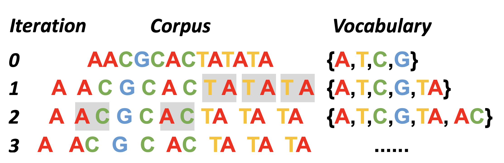

# Byte-Pair Encoding

Create a base vocabulary by taking all the symbols used to write the word of a corpus. These symbols can be ASCII or Unicode (larger). It then merges the most frequent pair (two consevutive token in a word) into a new symbol. This process is repeated until the desired vocabulary size is reached. The resulting vocabulary consists of subword units, which can be used to tokenize text.

<figure style="text-align:center">
  
  <figcaption>Example on Nucleotide</figcaption>
</figure>

## Algorithm
``` python
splits = {word: [c for c in word] for word in word_freqs.keys()}

def compute_pair_freqs(splits):
    pair_freqs = defaultdict(int)
    for word, freq in word_freqs.items():
        split = splits[word]
        if len(split) == 1:
            continue
        for i in range(len(split) - 1):
            pair = (split[i], split[i + 1])
            pair_freqs[pair] += freq
    return pair_freqs

def merge_pair(a, b, splits):
    for word in word_freqs:
        split = splits[word]
        if len(split) == 1:
            continue

        i = 0
        while i < len(split) - 1:
            if split[i] == a and split[i + 1] == b:
                split = split[:i] + [a + b] + split[i + 2 :]
            else:
                i += 1
        splits[word] = split
    return splits

# Add new token to vocab
while len(vocab) < vocab_size:
    pair_freqs = compute_pair_freqs(splits)
    best_pair = ""
    max_freq = None
    for pair, freq in pair_freqs.items():
        if max_freq is None or max_freq < freq:
            best_pair = pair
            max_freq = freq
    splits = merge_pair(*best_pair, splits)
    merges[best_pair] = best_pair[0] + best_pair[1]
    vocab.append(best_pair[0] + best_pair[1])

# Apply tokenization function
def tokenize(text):
    pre_tokenize_result = tokenizer._tokenizer.pre_tokenizer.pre_tokenize_str(text)
    pre_tokenized_text = [word for word, offset in pre_tokenize_result]
    splits = [[l for l in word] for word in pre_tokenized_text]
    for pair, merge in merges.items():
        for idx, split in enumerate(splits):
            i = 0
            while i < len(split) - 1:
                if split[i] == pair[0] and split[i + 1] == pair[1]:
                    split = split[:i] + [merge] + split[i + 2 :]
                else:
                    i += 1
            splits[idx] = split

    return sum(splits, [])

```

## Application
Usually the vocabulary size is around 50k. It is used in GPT, GPT-2, RoBERTa, BART, and DeBERTa.

# Byte level BPE
It operates at the byte level rather than character level. This approach offers universal character handling capabilities without predefined character sets, making it suitable for multilingual models and diverse text containing special symbols or emojis.

Key benefits of Byte-level BPE:

- Processes any Unicode character by working with raw bytes (0-255)
- Eliminates the need for separate vocabularies for different languages
- Handles code-mixed text and multilingual content efficiently
- Supports special characters and emojis without special accommodations
- Reduces memory requirements while maintaining representation capability
- Enables faster training and inference times for large language models

## Byte notations
- A byte is a unit of digital information that consists of 8 bits. 
- They a written in hexadecimal notation, which is a base-16 numbering system. 
- Each byte is represented by two hexadecimal digits, ranging from 00 to FF.


### UTF-8:
A variable-length encoding scheme that uses 1 to 4 bytes for each character.
- Ascii characters (0-127) are represented with 1 byte: `00` to `7F`
- Most Latin characters and symbols use 2 bytes
- Chinese, Japanese, Korean characters typically use 3 bytes
- Rare Unicode characters use 4 bytes

### Interpretate UTF-8 bytes:
1. The first byte indicates the number of bytes in the character.
2. The subsequent bytes (if any) start with `10`, indicating they are continuation bytes.
3. The remaining bits in the first byte and the continuation bytes are combined to form the character's binary representation.

Example:
The Chinese character "你" is represented as `E4 BD A0` in UTF-8:
1. E4 in binary is `11100100`:
- Starts with 1110, indicating this is the first byte of a 3-byte character
2. BD in binary is `10111101`:
- Starts with 10, indicating this is a continuation byte
3. A0 in binary is `10100000`:
- Starts with 10, indicating this is a continuation byte


## References
- [Byte Pair Encoding HF](https://huggingface.co/learn/llm-course/en/chapter6/5)