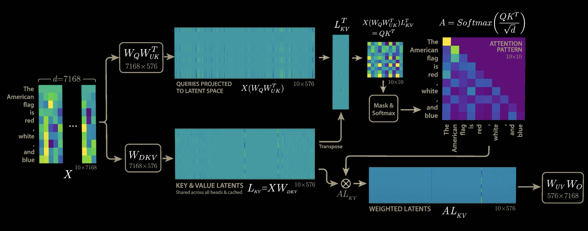

# KV Cache

## What is it?
In autoregressive models, the model generates one token at a time, and the previously generated tokens are used as context for generating the next token. 
The KV cache is a mechanism used in transformer models to store the key and value tensors generated during the previous forward passes. This allows the model to efficiently retrieve these tensors and avoid recomputing them for each token in the sequence. 

## Attention Heads
The goal of this layer is to compute the attention scores between the query and key tensors, and then use these scores to weight the value tensors.
The attention mechanism can be expressed mathematically as:

$\text{Attention}(Q, K, V) = \text{softmax}\left(\frac{QK^\top}{\sqrt{d_k}}\right)V$

Where:
- $Q = XW_Q$
- $K = XW_K$
- $V = XW_V$
-  $W_Q \in \mathbb{R}^{d \times d_h}$, $W_K \in \mathbb{R}^{d \times d_h}$, $W_V \in \mathbb{R}^{d \times d_h}$.
- $d_k$: The dimensionality of the key vectors, used for scaling.

Here, $d$ is the embedding dimensionality, and $d_h$ is the dimensionality of each attention head.

For each new token, we only need to compute the query tensor $Q$ for the new token, while the key and value tensors $K$ and $V$ can be retrieved from the KV cache. This allows us to avoid recomputing the key and value tensors for all previous tokens, which can be computationally expensive.
The KV cache is typically implemented as two separate tensors, one for the keys and one for the values. These tensors are updated at each time step as new tokens are generated.

<figure style="text-align:center">
  
    <figcaption>Source: <a href="https://youtu.be/0VLAoVGf_74?si=5lTVh4itHVpeNztU&t=585" target="_blank">KV Cache for MHA</a></figcaption>
</figure>

## Memory usage
The KV cache memory usage for the attention heads can be calculated as follows:

$\text{Cache Size} = 2 * (n_{tokens} * d_h) * n_{heads} * l$
Where:
- $n_{tokens}$: The number of tokens in the sequence.
- $d_h$: The dimensionality of each attention head.
- $n_{heads}$: The number of attention heads.
- $l$: The number of layers in the transformer model.

Example for Deepseek-V3:

Let $d_h = 128$, $n_{heads} =128$, $l = 61$

Cache size per token = $ 2 * 128 * 128 * 61 * 2$ $\approx$ 4 MB/token  (2 bytes/ number (fp16)) 

Total cache size = 4 MB * $10^5$ tokens $\approx$ 400 GB

# Other attention mechanisms
## Multi-Query Attention
The model uses a single set of keys and values for all attention heads, while still maintaining separate query vectors for each head. This method reduces heavily the memory usage. However, it can lead to a loss of expressiveness in the attention mechanism, as all heads share the same keys and values.

## Grouped-Query Attention
The model uses a set of keys and values for each group of attention heads, while still maintaining separate query vectors for each head. This allow for a balance between memory efficiency and expressiveness. 

## Multiple Head latent Attention
This approach projects our input into a latent space $L_{KV} = XW_{DKV}$, where $W_{DKV} \in \mathbb{R}^{d \times d_{KV}}$ and $d_{KV} < d$.
This allows us to reduce the dimensionality of the key and value tensors, which can help to reduce memory usage and improve computational efficiency.

We then define new key and value tensors as follows:
- $K = L_{KV}W_K$ 
- $V = L_{KV}W_V$

where $W_K \in \mathbb{R}^{d_{KV} \times d_h}$ and $W_V \in \mathbb{R}^{d_{KV} \times d_h}$.

<figure style="text-align:center">
  
    <figcaption>Source: <a href="https://youtu.be/0VLAoVGf_74?si=kXpeNn0wWcQ4y8Ri&t=840" target="_blank">KV Cache for MHA</a></figcaption>
</figure>

From this, by rearranging the computation, we can obtain the following way of computing the attention:

<figure style="text-align:center">
  
    <figcaption>Source: <a href="https://youtu.be/0VLAoVGf_74?si=kXpeNn0wWcQ4y8Ri&t=840" target="_blank">KV Cache for MHA</a></figcaption>
</figure>

Now we can only cache the latent space $L_{KV}$, which is much smaller than the original key and value tensors.

### Proof:
We can actually start from the original multi-head attention mechanism and show how we can reduce the memory usage.
1. The original attention mechanism computes the attention scores using the query and key tensors:
   $$\text{Attention}(Q, K, V) = \text{softmax}\left(\frac{QK^\top}{\sqrt{d_k}}\right)V$$
2. By substituting the key and value tensors in terms of the input, we can rewrite the attention mechanism as:

    $$\text{Attention}(XW_Q, XW_K, XW_V) = \text{softmax}\left(\frac{XW_Q(XW_K)^\top}{\sqrt{d_k}}\right)(XW_V)$$  

    $$= \text{softmax}\left(\frac{XW_QW_K^\top X^\top}{\sqrt{d_k}}\right)(XW_V)$$
3. We see that we can rearrange the computation of our key with the query $W_QW_K^\top$ and the value at the end. Thus we can just cache the input $X$ and compute the key and value tensors on the fly. 

This would take a cache memory per token of $d * l$, where $d$ is the dimensionality of the embedding space.

4. However, d can be very large, and here comes the idea of projecting the input into a latent space $L_{KV} = XW_{DKV}$, where $W_{DKV} \in \mathbb{R}^{d \times d_{KV}}$ and $d_{KV} < d$.
5. We can then define new key and value tensors as follows:
   - $K = L_{KV}W_{UK}$ 
   - $V = L_{KV}W_{UV}$

   where $W_{UK} \in \mathbb{R}^{d_{KV} \times d_h}$ and $W_{UV} \in \mathbb{R}^{d_{KV} \times d_h}$.
6. This allows us to reduce the dimensionality of the key and value tensors, which can help to reduce memory usage and improve computational efficiency.
7. The attention mechanism can then be expressed as:

    $$\text{Attention}(XW_Q, L_{KV}W_{UK}, L_{KV}W_{UV}) = \text{softmax}\left(\frac{XW_Q(L_{KV}W_{UK})^\top}{\sqrt{d_k}}\right)(L_{KV}W_{UV})$$
    
    $$= \text{softmax}\left(\frac{XW_QW_{UK}^\top L_{KV}^\top}{\sqrt{d_k}}\right)(L_{KV}W_{UV})$$
8. The cache memory per token is now $d_{KV} * l$, which is much smaller than the original key and value tensors. This reduce memory comes at the cost of a small increase in parameter count, as we now have to store the projection matrices $W_{DKV}$, $W_{UK}$, and $W_{UV}$.

### Side note
Rotary positional embeddings (RoPE) is incompatible with the multiple head latent attention mechanism. One solution is to use additional query and key to carry RoPE and concatenate them with our query and key. They should also be cached but not considered here.

<figure style="text-align:center">
  
    <figcaption>Source: <a href="https://arxiv.org/pdf/2405.04434" target="_blank">KV Cache for MLA with RoPE</a></figcaption>
</figure>

## Comparison of Attention Mechanisms

| Attention Mechanism    | KV Cache Formula per Token                     | Result                  |
|-------------------------|-----------------------------------------------|-------------------------|
| Standard Attention      | $2 \cdot d_h \cdot n_{heads} \cdot l$ | $4 MB$ |
| Multi-Query Attention   | $2 \cdot d_h \cdot l$                | $31 KB$ |
| Grouped-Query Attention | $2 \cdot d_h \cdot n_{groups} \cdot l$| $500KB$ |
| Multiple Head Latent Attention | $ d_{KV} \cdot l$ | $70 KB$ |

Here, $d_h = 128$, $n_{heads} = 128$, $l = 61$, $d_{KV} = 576$, and $n_{groups} = 16$ with a grouping factor of 8.

## References
- [Welch Labs channel](https://www.youtube.com/watch?v=0VLAoVGf_74&t=2s)
- [DeepSeek-V2 paper](https://arxiv.org/pdf/2405.04434)