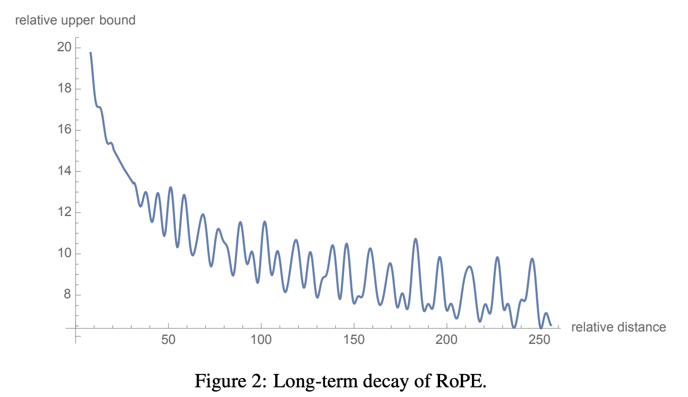

# Rotary Position Embedding (RoPE)

# Positional Encoding
Positional encoding is used to inject information about the position of tokens in the sequence. This is because transformers process the input sequence as a whole, without any inherent notion of order contrary to RNNs.

Indeed, let $P$ be the permutation matrix, we have:
$$
X' = P X
$$
Where $X$ is the input sequence and $X'$ is the row-permuted version of $X$. The permutation matrix $P$ is a square matrix that rearranges the rows of the input matrix.

Then, all subsequent computations also get permuted:
- $\mathbf{Q}' = \mathbf{P}\mathbf{Q}$
- $\mathbf{K}' = \mathbf{P}\mathbf{K}$
- $\mathbf{V}' = \mathbf{P}\mathbf{V}$

Thus we have:
$$
\text{Attention}(Q', K', V') = \text{softmax}\left(\frac{Q'K'^\top}{\sqrt{d_k}}\right)V' = \text{softmax}\left(\frac{(PQ)(PK)^\top}{\sqrt{d_k}}\right)(PV) = P \text{Attention}(Q, K, V)
$$

This means that the attention mechanism is invariant to the order of the tokens in the sequence. To overcome this, we need to inject some information about the position of the tokens in the sequence.

## Absolute Positional Encoding
### Learned Positional Embeddings

The positional embeddings are learned during training and are added to the input embeddings. Each position in the sequence has a unique embedding, which is learned from the data.

**Application example** : BERT

**cons**:
- The model cannot generalize to sequences longer than the training data, as the learned embeddings are fixed for each position. 
- The model cannot learn the relative position of tokens, only their absolute positions.

### Sinusoidal Positional Embeddings
In this method, sinusoidal functions are used to generate positional embeddings. The idea is to create a unique embedding for each position in the sequence using sine and cosine functions of different frequencies. This allows the model to learn the relative positions of tokens.
**Application**: GPT-2, GPT-3
**cons**:
- The model cannot learn the relative position of tokens, only their absolute positions.

## Relative Positional Encoding
In this method, the attention mechanism is modified to use relative positions instead of absolute positions. The idea is to compute the attention scores based on the relative positions of the tokens in the sequence.

### RoPE
This method directly acts on the query and key vectors, allowing the model to learn the relative positions of tokens. The goal is to have an encoding function that is only sensitive to the value of $q$ and $k$ and their relative positions $m-n$. 

The intuition comes from the dot product in attention:
$$
q \cdot k = ||q|| ||k|| \cos(\theta)
$$
This result only depends on the angle between the two vectors, which is related to their relative position.

The following example is an illustration of the core idea of RoPE
We can use a function $f$ that only depends on the relative position $m-n$, let $\varepsilon \in [0, 2\pi] $:
$$
\begin{align*}
RoPE(x, m) &= x e^{mi\epsilon} \\
\langle RoPE(q_j,m), RoPE(k_j,n) \rangle  &= \langle  q_je^{mi\epsilon}, k_je^{ni\epsilon} \rangle\\
&= q_jk_j e^{(m-n)i\epsilon} \\
&= RoPE(q_jk_j,m-n) \\
\end{align*}
$$
This allows the model to learn the relative positions of tokens, as the attention scores will depend on the relative positions of the tokens in the sequence.

The RoPE for a token at position $m$ is defined as:
$$
f(q,m) = 
\begin{pmatrix}
M_0 & 0 & \ldots & 0 \\
0 & M_1 & \ldots & 0 \\
\vdots & \vdots & \ddots & \vdots \\
0 & 0 & \ldots & M_{d/2-1}
\end{pmatrix}
\begin{pmatrix}
q_0 \\
q_1 \\
q_2 \\
q_3 \\
\vdots \\
q_{d-2} \\
q_{d-1}
\end{pmatrix}
$$

where each $M_i$ is a 2×2 rotation matrix defined as:

$$
M_i = 
\begin{pmatrix}
\cos(m\theta_i) & -\sin(m\theta_i) \\
\sin(m\theta_i) & \cos(m\theta_i)
\end{pmatrix}
$$

And we do the same for the key vector $k$.
The angles $\theta_i$ are defined as:
$$
\theta_i = \frac{1}{10000^{\frac{2i}{d}}}
$$
where $d$ is the dimensionality of the embedding space. This setting allows a long=term decay property, meaning that the inner-product will decay when the relative distance between the two tokens increases.

<figure style="text-align:center">
  
    <figcaption>Source: <a href="https://arxiv.org/pdf/2104.09864.pdf" target="_blank">RoPE paper</a></figcaption>
</figure>

### Implementation
In practice RoPE is not computed by using the above matrix multiplication, but by using a more efficient method.

$$
\mathbf{R}^{d}_{\Theta, m} \mathbf{x} = 
\begin{pmatrix}
x_1 \\
x_2 \\
x_3 \\
x_4 \\
\vdots \\
x_{d-1} \\
x_d
\end{pmatrix}
\otimes
\begin{pmatrix}
\cos m\theta_1 \\
\cos m\theta_1 \\
\cos m\theta_2 \\
\cos m\theta_2 \\
\vdots \\
\cos m\theta_{d/2} \\
\cos m\theta_{d/2}
\end{pmatrix}
+
\begin{pmatrix}
-x_2 \\
x_1 \\
-x_4 \\
x_3 \\
\vdots \\
-x_d \\
x_{d-1}
\end{pmatrix}
\otimes
\begin{pmatrix}
\sin m\theta_1 \\
\sin m\theta_1 \\
\sin m\theta_2 \\
\sin m\theta_2 \\
\vdots \\
\sin m\theta_{d/2} \\
\sin m\theta_{d/2}
\end{pmatrix}
$$


``` python
import torch


class Rotary(torch.nn.Module):
    def __init__(self, dim, base=10000):
        super().__init__()
        inv_freq = 1.0 / (base ** (torch.arange(0, dim, 2).float() / dim))
        self.register_buffer("inv_freq", inv_freq)
        self.seq_len_cached = None
        self.cos_cached = None
        self.sin_cached = None

    def forward(self, x, seq_dim=1):
        seq_len = x.shape[seq_dim]
        if seq_len != self.seq_len_cached:
            self.seq_len_cached = seq_len
            t = torch.arange(x.shape[seq_dim], device=x.device).type_as(self.inv_freq)
            freqs = torch.einsum("i,j->ij", t, self.inv_freq)
            emb = torch.cat((freqs, freqs), dim=-1).to(x.device)
            self.cos_cached = emb.cos()[:, None, None, :]
            self.sin_cached = emb.sin()[:, None, None, :]
        return self.cos_cached, self.sin_cached


# rotary pos emb helpers:

def rotate_half(x):
    x1, x2 = x[..., : x.shape[-1] // 2], x[..., x.shape[-1] // 2 :]
    return torch.cat(
        (-x2, x1), dim=x1.ndim - 1
    )  # dim=-1 triggers a bug in torch < 1.8.0


@torch.jit.script
def apply_rotary_pos_emb(q, k, cos, sin):
    return (q * cos) + (rotate_half(q) * sin), (k * cos) + (rotate_half(k) * sin)
```

# References
- [RoPE paper](https://arxiv.org/pdf/2104.09864)
- [EleutherAI blog](https://blog.eleuther.ai/rotary-embeddings/)
