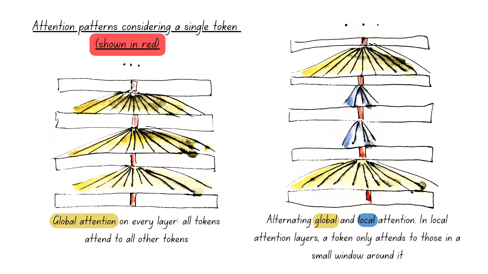

# BERT
BERT (Bidirectional Encoder Representations from Transformers) is an NLP model developed by Google. It is an encoder-only transformer model. It was released in October 2018 by Jacob Devlin et al. at Google AI Language.

## Architecture:
- Positional encoding: learned embeddings
- Self-attention mechanism

## Pre-training:
Trained on a large corpus of text data using two tasks:
- Masked Language Model (MLM)
- Next Sentence Prediction (NSP)

The training corpus is a combination of the BooksCorpus (800M words) and English Wikipedia (2,500M words, only text no list, table, headers).

## Model size:
### BERT-base:
- embedding size: 768
- layers: 12
- attention heads: 12
  
Total parameters: 110M
### BERT-large:
- embedding size: 1024
- layers: 24
- attention heads: 16

Total parameters: 345M

The input sequence length is 512 tokens. This is due to the positional encoding, which is limited to 512 tokens.

## BERT Variants:
### RoBERTa 7/2019

- BERT was undertrained on 3.3B words (16GB data), RoBERTa trained on 25B-30B tokens (160GB data)
- NSP is not useful, removing it improves downstream task
- Larger batch size increase the perplexity
- Dynamic masking: different masking for each input fed into the model
- Vocabulary size: 50k
- Batch: 8k

### DeBERTa 6/2020
- Use disentangle attention mechanism, each input is represented using two vectors one for content and the other for the position
- Enhanced Mask Decoder, add position information before the softmax operation to predict masked token. 
- Adversarial training: Scale-invariant-Fine-Tuning(SiFT), adds perturbation in the word embedding after a normalization layer. The goal is to keep the same output distribution in a task-specific perturbation
- vocabulary size: 128K
- Batch: 2k

### MosaicBERT 12/2023
- FlashAttention
- Attention with Linear Biases(ALiBi), remove the positional encoding, add a negative bias on the attention scores that grows with the absolute distance between tokens weighted by a slope m. m follows a geometric sequence each head has ratio of 2^(-8/n) where n is the total number of heads

-> Allows to increase context length during inference or finetuning
- Gated Linear Units (GLU 2016) combined with Gaussian-error Linear Unit (GeLU) → GeGLU
- Unpadding
- MLM Masking ratio and Dropout: 30%, 0.1 dropout to the feedforward
- Mixed precision: bfloat16 for layerNorm
- Vocabulary size: 30,528 multiple of 64
- Batch: gbs=4096, mbs=128 on sequence of size 128

# ModernBERT
## Introduction
ModernBERT has been introduced in December 2024 by Answer AI and Lighton AI. It is a lightweight and efficient version of BERT, designed to be faster and more memory-efficient while maintaining high performance on various NLP tasks.

Here are the summary of the key features and improvements of ModernBERT:
- **RoPE positional encoding**: use of RoPE (Rotary Positional Encoding) to improve the model's ability to capture long-range dependencies in text.
- **Flash attention**: reduces the computational complexity of the self-attention mechanism, making it faster and more efficient.
- **Altenating attention**: alternate between global and local attention. 
- **Unpadding and Sequence Packing**
- **Paying Attention to Hardware**
- **Bias**: removed all bias terms in all linear layers, except for the final decoder layer, and also in the Layer Norms. 
- **Layer Norm**: added a normalization layer after the embedding layer.
- **Activation function**: replaced the GeLU activation function with a GeGLU.

## Alternating Attention
The attention mechanism only attends the full input sequence every three layers (global attention), while the other layers focus on the 128 tokens nearest to itself (local attention). This allows for a faster processing of the input sequence.

<figure style="text-align:center">
  
    <figcaption>Source: <a href="https://huggingface.co/blog/modernbert" target="_blank">HF blog</a></figcaption>
</figure>

## Unpadding and Sequence Packing
For processing multiple sequences in a batch, we need to pad the sequences to the same length. Otherwise, some thread becomes idle while waiting for the longest sequence to finish. This is inefficient and lead to wasted computational resources. 

However, padding leads to a lot of wasted memory and computation. Then we remove them and pack them into a mini-batch size of 1. 

## Paying attention to Hardware
The architecture of the model is designed to be hardware-aware, meaning that it takes into account the specific hardware on which it will be run. This comes from these two observations:

1. Deep & Narrow vs Wide & Shallow: Research shows that deeper models with narrower layers, often perform better than shallow models with fewer, wider layers. However, this is a double-edged sword: the deeper the model, the less parallelizable it becomes, and thus, the slower it runs at identical parameter counts.

2. Hardware Efficiency: Model dimensions need to align well with GPU hardware for maximum performance, and different target GPUs result in different constraints.

## Training
**Tokenizer**: used the BPE tokenizer with a vocabulary size of 50368. This number does have an impact on the performance of the model, Karpathy found that the optimal vocabulary size that going from 50257 to 50304 which is the nearest multiple of 64 yields a 25% performance improvement for nanoGPT.

**Data**: 2 trillion tokens of text data, including primarily English data from a variety of data sources, including web documents, code, and scientific literature.

**Optimizer**: StableAdamW

## Model Size:
### ModernBERT-base:
- embedding size: 768
- layers: 22
- attention heads: 12

Total parameters: 149M
### ModernBERT-large:
- embedding size: 1024
- layers: 28
- attention heads: 16

Total parameters: 395M
