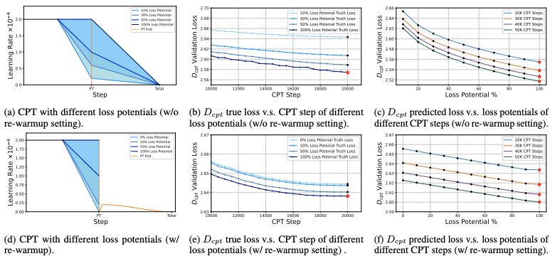
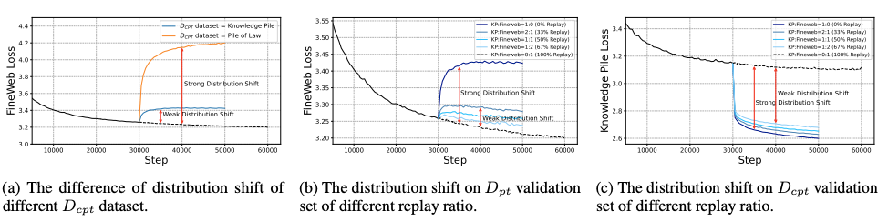
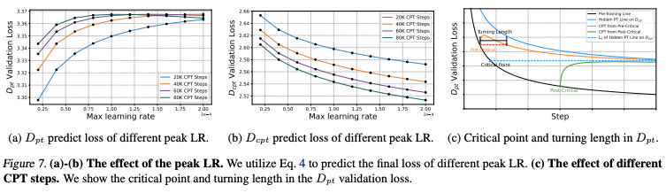

# How to Do Continual Pre-Training: Key Takeaways

This paper provides the first comprehensive mathematical framework for optimizing continual pre-training (CPT) of large language models. Here are the essential practical insights for practitioners:

## Core Trade-off Understanding

**The fundamental reality**: There's always a trade-off between maintaining general domain performance and improving domain-specific performance. You can't have both perfectly, but you can optimize the balance.

## Key Practical Recommendations

### 1. **Choose the Right Starting Model**

**Use models with higher "loss potential"** - models that haven't been fully annealed during pre-training adapt better to new domains. When possible:
- Look for models that stopped training before their learning rate reached zero
- Avoid fully converged models if domain adaptation is the goal

### 2. **Optimize The Learning Rate Strategy**

**Peak Learning Rate Selection**:
- Higher peak learning rates accelerate domain-specific improvement but hurt general performance faster
- Lower peak learning rates preserve general abilities but slow domain adaptation
- The optimal choice depends on the balance preference between general vs. domain performance

**Re-warmup Strategy**:
- Re-warming to 10% of the original peak learning rate is a common effective practice
- Models with higher loss potential consistently achieve better domain performance regardless of re-warmup strategy

<figure style="text-align:center">
  
    <figcaption> Annealing</figcaption>
</figure>

### 3. **Get The Replay Ratio Right**

**Data Mixing Guidelines**:
- Higher replay ratios (more original training data mixed in) lead to smaller distribution shifts
- This preserves general performance but slows domain adaptation
- There's an optimal replay ratio for each scenario that depends on the performance balance goals
- The paper provides mathematical guidance to find this optimal ratio

<figure style="text-align:center">
  
    <figcaption> Replay Ratio</figcaption>
</figure>

### 4. **Plan The Training Steps Strategically**

**Understand the "Critical Point"**:
- There's a critical point in training where the dynamics change
- If you start CPT before this point, general performance may initially drop but can recover to below original levels
- After the critical point, general performance will likely never return to original levels regardless of training length
- More training often leads to worse general abilities once you're past the critical point

<figure style="text-align:center">
  
    <figcaption> Critical Point</figcaption>
</figure>

### 5. **Balance Performance Goals Mathematically**

**Set Clear Priorities**:
- Define weights for how much you care about general vs. domain performance
- Use these weights to find optimal hyperparameters (learning rate, replay ratio, training steps)
- The paper provides formulas to calculate optimal settings based on the priorities

### 6. **Working with Unknown Models**

**For Open-Source Models** (when you don't know training details):
- Use a proxy general dataset (like Common Crawl) to approximate the original training distribution
- Assume the model was fully annealed (learning rate reached zero)
- Fit the scaling law using shorter training runs to predict longer training behavior

## Practical Decision Framework

**Before starting CPT, find the priorities**:
1. How much do I care about preserving general abilities vs. gaining domain expertise?
2. What's my computational budget for training steps?
3. Do I have access to the original training data for replay?
4. What's the distribution distance between my target domain and the original training data?

**Then optimize the hyperparameters accordingly**:
- Strong domain focus: Higher learning rates, lower replay ratios, more training steps
- Balanced approach: Moderate settings guided by the mathematical framework
- General preservation: Lower learning rates, higher replay ratios, careful step planning

## Bottom Line

The paper's main practical contribution is replacing trial-and-error hyperparameter tuning with mathematical guidance. Instead of guessing, you can now predict how different choices will affect the general vs. domain performance trade-off and optimize accordingly.

The key insight: **continual pre-training is predictable**, it just needs to understand the underlying dynamics and use the right mathematical tools to optimize for the specific goals.