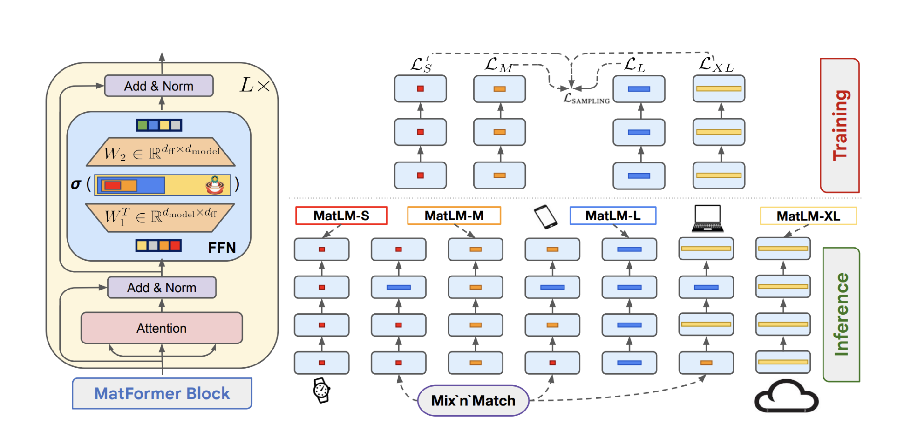

# Introduction
MatFormer short for Matryoshka Transformer is an architecture that allows for the training of one universal model and can extract multiple smaller models without any additional training cost.

It is used in the Gemma 3n model. The model is reportedly 4B but it doesn't take into account the Per-Layer Embedding that is loaded on demand from the CPU to the SSD, it represents 2.55B parameters. It represents the embedding matrix ($256,000 * 2048 * 2 bytes ≈ 1.05 GB$), we accept a bit of latency for memory space. 

<figure style="text-align:center">
  
    <figcaption> MatFormer</figcaption>
</figure>

# Training
In classic Transformer, the FFN layer is of fixed size $d$ and expanded to $d_{ff}$ usually it is a factor of $\geq 4$ of $d$. In MatFormer, we will train the model on different scale $d_{ff}/2$, $d_{ff}/4$, ...
We will sample them uniformly, so each subset is trained independantly and the smaller subset performs significantly better than a separate model trained from scratch at that smaller size. It has benefited from the "knowledge transfer" of being co-trained with the larger, more capable paths.
The FFN can be written as:

$$
T^{\mathrm{FFN}}_i(x) = \sigma \left( x \cdot \mathbf{W}_1[0 : m_i]^{\top} \right) \cdot \mathbf{W}_2[0 : m_i]
$$

where $m_i$ is the size of the FFN for the $i$-th layer and $\mathbf{W}_1$ and $\mathbf{W}_2$ are the weight matrices.
Each $T_i$ is such that $T_1 \subset T_2 \subset \cdots \subset T_g$ where $T_g$ is the full FFN.

# Mix and Match
Another interesting observation is that each layer contributes differently to different task, so if we know that the FFN of layer 5 is crucial for handling grammatical nuance, then we can take the full FFN and lower for less important layer.

